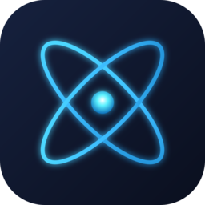

<div align="center">



# NeXium

A Nintendo Switch emulator written in Rust.

[nexium-emu.org](https://nexium-emu.org)

[](https://github.com/nexium-emu/nexium/actions/workflows/ci.yml)
[](LICENSE)
[](https://ko-fi.com/nexium_emu)
[](https://discord.gg/qx97vK5tq7)

</div>

NeXium runs Switch homebrew (and some commercial software) on a custom AArch64-to-x86-64 recompiler and a Maxwell-to-Vulkan graphics layer. It's early. Plenty of things don't work yet, and the ones that do tend to break in new and interesting ways.

Website: https://nexium-emu.org

Discord: https://discord.gg/qx97vK5tq7

## Legal

NeXium ships no Nintendo code, firmware, or keys, and it never will. Bring your own dumps from hardware you own. It's for homebrew and for software you're allowed to run.

Official release archives bundle the FFmpeg command-line program under the GNU LGPL v2.1 or later. FFmpeg remains separately licensed from NeXium. Its exact unmodified source, upstream signature, license, and build configuration are included under `licenses/FFmpeg` in each archive. See `THIRD_PARTY_NOTICES.txt` for details.

## Status

Work in progress and rough. Homebrew is the main focus right now; commercial titles are hit and miss. Expect crashes.

## What's here

- Two CPU JITs you can switch between at runtime: Rustarmic (Rust, written for this project) and Dynarmic (C++, through bindings).
- Maxwell GPU emulation on wgpu/Vulkan, with a SPIR-V shader path.
- A Horizon OS kernel: syscalls, IPC, and enough services to get things booting.
- `.nro` homebrew loading.
- Audio through cpal, controllers through SDL3, and a 60 Hz frame pacer.
- A desktop UI (egui) for picking titles and settings.

## Building

You'll need Rust 1.85+ and a C/C++ toolchain with CMake and Ninja (SDL3 builds from source, and the Dynarmic backend is C++). On Linux, also install the dev packages for GTK3, ALSA, udev, X11/Wayland, and libxkbcommon.

NeXium expects rustarmic checked out next to it:

```sh
git clone https://github.com/nexium-emu/nexium.git
git clone https://github.com/nexium-emu/rustarmic.git
cd nexium
cargo run --release -p nexium-gui --no-default-features --features backend-rustarmic -- /path/to/app.nro
```

Drop the `--no-default-features --features backend-rustarmic` flags to build both CPU backends (that also compiles the C++ Dynarmic JIT). Run with no path to open the UI.

Video playback in source builds uses `ffmpeg` from beside the NeXium executable or from `PATH`. Set `NEXIUM_FFMPEG` to select another executable, or `NEXIUM_VIDEO_FFMPEG=0` to disable it. Official release archives already include the required minimal FFmpeg build.

## Layout

| Crate | What it does |
|---|---|
| nexium-cpu | Chooses between the Rustarmic and Dynarmic backends |
| nexium-memory | Guest address space and fastmem arena |
| nexium-kernel | Horizon kernel: syscalls, scheduling, services |
| nexium-ipc, nexium-cmif | IPC marshalling (HIPC/CMIF) |
| nexium-nvdrv | nvdrv and GPU submission |
| nexium-gpu | Maxwell command stream to Vulkan |
| nexium-shader, nexium-spirv | Maxwell shaders to SPIR-V |
| nexium-loader | NRO/NSO loading |
| nexium-core | Boot |
| nexium-gui | Front end: UI, audio, input |
| nexium-common | Shared utilities |

The recompiler lives in its own repo: https://github.com/nexium-emu/rustarmic

## Support

NeXium is a passion project I build as a hobby, and watching it boot more titles and improve line by line is the fun part. With my day job cutting hours, the time and money I'd like to spend on development are getting harder to come by, so Ko-fi subscriptions are now open.

If you like NeXium and want to get me a coffee (or beer) while I code, it goes straight into new features, further optimizations, and making more games available:

**https://ko-fi.com/nexium_emu**

Thanks to all the testers who put time into quality builds and bug reports, and to everyone who supports the project. Special thanks to Collecting, who is working hard on new titles with me. If a donation isn't in the cards, joining the [Discord](https://discord.gg/qx97vK5tq7) and testing builds helps just as much.

## Thanks

The name NeXium was DerekTurtleRoe's idea.

A lot of open-source work made this possible:

- switchbrew's libnx, nx-hbmenu, nx-hbloader, and wiki, which document most of what's known about Switch homebrew and Horizon OS.
- Atmosphère, for how the kernel and system actually behave.
- Mesa, for NVIDIA Maxwell and shader details.
- deko3d, the homebrew graphics API.
- dynarmic by MerryMage, the C++ ARM JIT used as a backend.
- disarm64 and iced-x86, the ARM decoder and x86 encoder Rustarmic is built on.
- wgpu, egui, winit, SDL, and cpal for graphics, UI, windowing, input, and audio.
- libdragon and Fast3D from the N64 homebrew side, useful while bringing up N64 ports.

And the homebrew, decompilation, and port projects used for testing: sm64ex, SpaghettiKart, Ship of Harkinian, Starship, and others.

## License

MIT. See [LICENSE](LICENSE).
